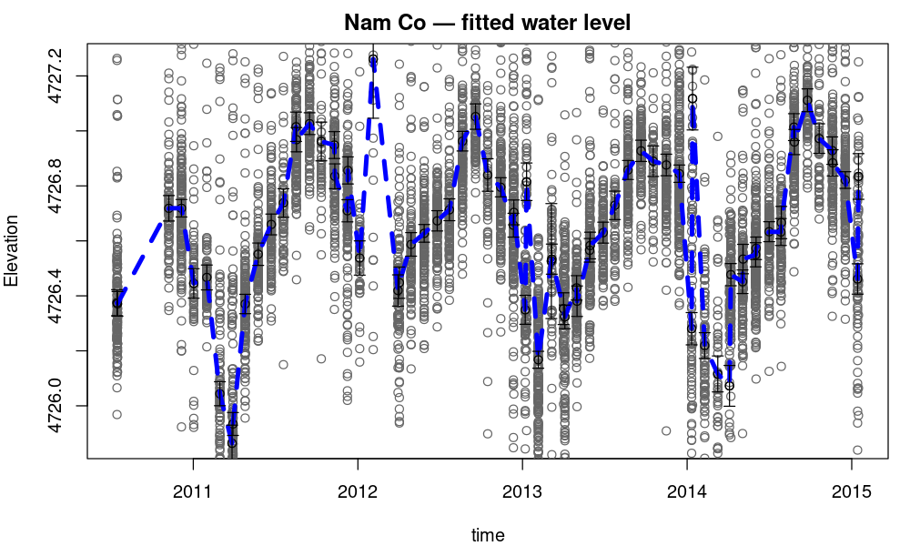

# tsHydroV2

R package that reconstructs water-level time series from satellite altimetry data.

This is a re-implementation of [`tsHydro`](https://github.com/cavios/tshydro)
that swaps the underlying TMB / C++ model for an [RTMB](https://kaskr.r-universe.dev/RTMB)
model written in pure R. The statistical model is unchanged — see the
*Comparison with tsHydro* section below — but there is no longer any C++
compilation step, so installation is faster and the package is easier to
modify.

## Installation

The package only requires `RTMB` (and its dependencies). No compiler is needed.

```r
install.packages("RTMB")           # if you do not have it yet

# from a local checkout:
install.packages("tsHydroV2", repos = NULL, type = "source")

# or, from the package source directory:
#   make
```

The shipped `Makefile` is meant to be run from inside the `tsHydroV2/`
source directory. It will:

```
make            # regenerate docs, build tarball, install
make install    # rebuild tarball + install
make check      # R CMD check the built tarball
make clean      # remove tarball, install marker, docs marker
```

## Quick start

```r
library(tsHydroV2)
data(lakelevels)         # or data(namco)

fit <- get.TS(lakelevels)

summary(fit)
plot(fit, addError = TRUE, col = "blue")
export.tsHydro(fit, file = "myTS.dat", exportPar = TRUE)
```

`get.TS()` returns an object of class `tsHydro` with components:

- `pl$u`, `plsd$u`    — estimated water level at each unique observation time and its sd
- `obstimes`          — the corresponding times (decimal years)
- `aveH`, `sdAveH`    — average water level over the period
- `opt`               — the `nlminb` result (parameter estimates on log scale)
- `obj`               — the underlying `RTMB::MakeADFun` object (for advanced use)
- `newdat`            — optional, see below

## Worked example: Lake Nam Co

A full session on the bundled `namco` dataset (8,476 satellite altimetry
observations of Lake Nam Co):

```r
library(tsHydroV2)
data(namco)

head(namco)
#>      height lake track     time
#> 49 4929.231    1     1 2010.537
#> 50 4729.630    1     1 2010.537
#> 51 4726.684    1     1 2010.537
#> 52 4728.619    1     1 2010.537
#> 53 4727.517    1     1 2010.537
#> 54 4727.264    1     1 2010.537

fit <- get.TS(namco)

# inspect the fit
summary(fit)
#> Summary for get.TS
#> Converged with a negative log likelihood of 9555.502
#> Number of parameters: 2
#> Par 1 : Sigma   = 0.212
#> Par 2 : SigmaRW = 1.966

# estimated water level at each observed time
head(data.frame(time = fit$obstimes,
                wl   = fit$pl$u,
                sd   = fit$plsd$u))
#>       time       wl         sd
#> 1 2010.537 4726.375 0.02374676
#> 2 2010.539 4726.371 0.02238243
#> 3 2010.851 4726.719 0.02317644
#> 4 2010.928 4726.719 0.01591578
#> 5 2011.003 4726.445 0.02686617
#> 6 2011.082 4726.467 0.02263701

# average water level over the period (with sd)
fit$aveH;  fit$sdAveH
#> [1] 4726.6393
#> [1] 0.0036263

# plot with 2 SE error bars on each estimate
plot(fit, addError = TRUE, col = "blue",
     main = "Nam Co — fitted water level")

# save the fitted series to a text file
export.tsHydro(fit, file = "namco_ts.dat", exportPar = TRUE)
```

The plot it produces:



### Predicting at new times and grouping

`newdat` lets you (a) ask for the modelled water level at arbitrary times
and (b) get a group-average (e.g. monthly mean) along with its sd:

```r
# monthly grid spanning the data
month_grid <- seq(2010.5, 2015.0, by = 1/12)
newdat <- data.frame(time  = month_grid,
                     group = as.integer(floor((month_grid - 2010.5) * 12)))

fit_m <- get.TS(namco, newdat = newdat)

# per-time predictions
head(fit_m$newdat)
# per-group averages
head(fit_m$groupAve)
```

## Common options

```r
# average water level per group (e.g., monthly means):
newdat <- data.frame(time  = grid_of_times,
                     group = month_index)
fit <- get.TS(lakelevels, newdat = newdat)
fit$groupAve

# robust outlier handling on/off:
fit <- get.TS(lakelevels, estP = TRUE)        # estimate outlier fraction
fit <- get.TS(lakelevels, init.logit = -10)   # essentially Gaussian

# separate observation sd per satellite, per track, or per quality flag:
fit <- get.TS(dat)                            # default: one sd per satellite
fit <- get.TS(dat, varPerTrack   = TRUE)      # one sd per track
fit <- get.TS(dat, varPerQuality = TRUE)      # one sd per quality id (needs dat$qf)
```

## Datasets

Two example datasets are bundled:

- `lakelevels` — 5,433 altimetry observations from a small lake.
- `namco`      — 8,476 observations from Lake Nam Co.

Both have columns `time`, `height`, `track`, `lake`.

## Comparison with `tsHydro`

The likelihood is identical to the original `tsHydro` package. Verified on
the bundled datasets:

| dataset    | joint-NLL agreement | param agreement                | runtime (RTMB / TMB) |
|------------|---------------------|--------------------------------|----------------------|
| namco      | exact (1.5e-11)     | identical to ~1e-13            | ~30% faster          |
| lakelevels | exact (0)           | identical from matched starts; defaults can land in different local minima | comparable           |

A multistart sweep over 32 starting values finds the same 6 distinct local
optima in both packages, to all printed digits. If you see disagreement, run
with several starting points — both implementations are sensitive to
`init.logsigmarw` and `init.logSigma` on noisy data.

The default `init.logSigma = 10` (i.e. starting observation σ ≈ 22 000) is
often too large; for noisy lake data, try `init.logsigmarw = -2` and
`init.logSigma = -2` and keep the best result.

## What changed under the hood

- The C++ template (`src/tsHydro.cpp`) was rewritten as an R closure
  (`R/model.R`, `tsHydro_nll()`) and called via `RTMB::MakeADFun`.
- No `src/`, no `LinkingTo`, no compile step.
- `DESCRIPTION` now only `Imports: RTMB`.
- Inside the model, RTMB's operator overloads are activated for `c` and
  `[<-` (required so AD dispatch survives byte-compilation in package
  context), and `dnorm` is called as `RTMB::dnorm` for the same reason.

## Citation

If you use this package, please cite the underlying methods paper:

> Nielsen, K., Stenseng, L., Andersen, O. B., Villadsen, H., & Knudsen, P.
> (2015). Validation of CryoSat-2 SAR mode based lake levels.
> *Remote Sensing of Environment*, **171**, 162–170.

Or in R: `citation("tsHydroV2")`.

## License

BSD-2-Clause. See [`LICENSE`](LICENSE).
